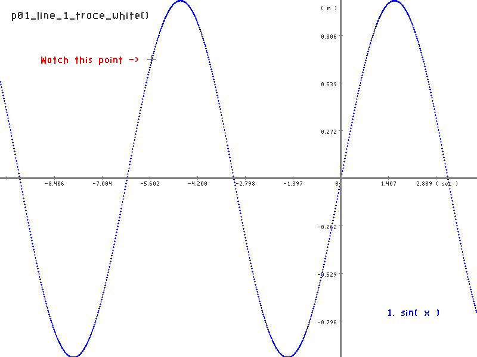
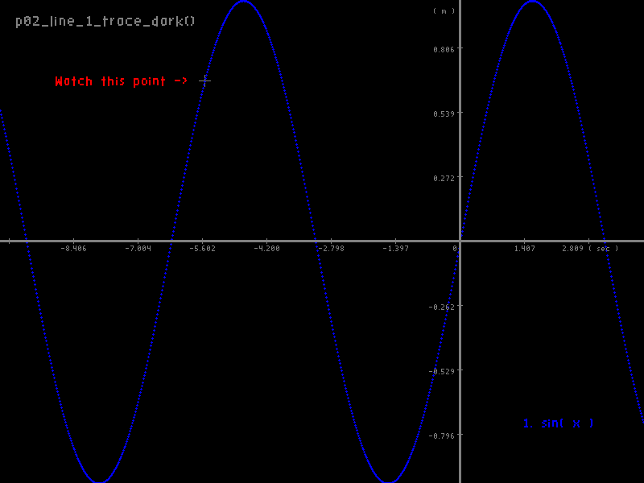
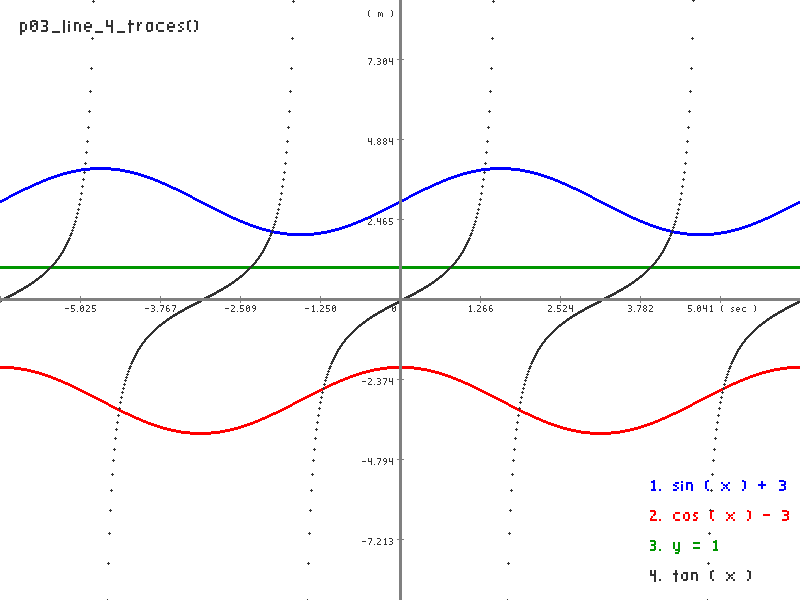
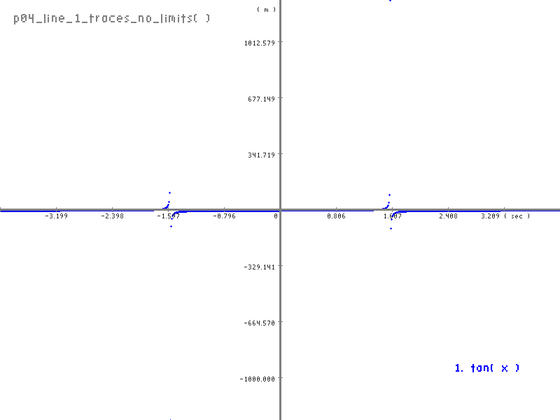
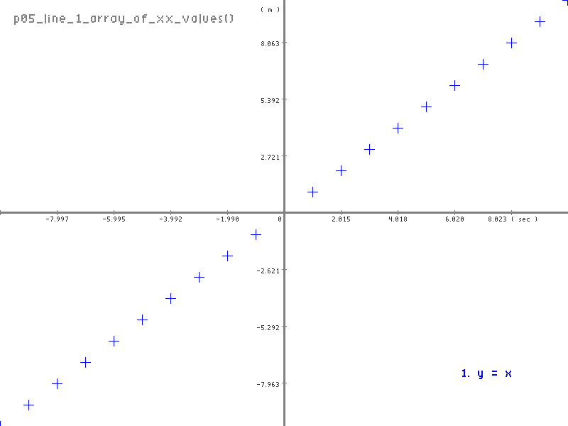
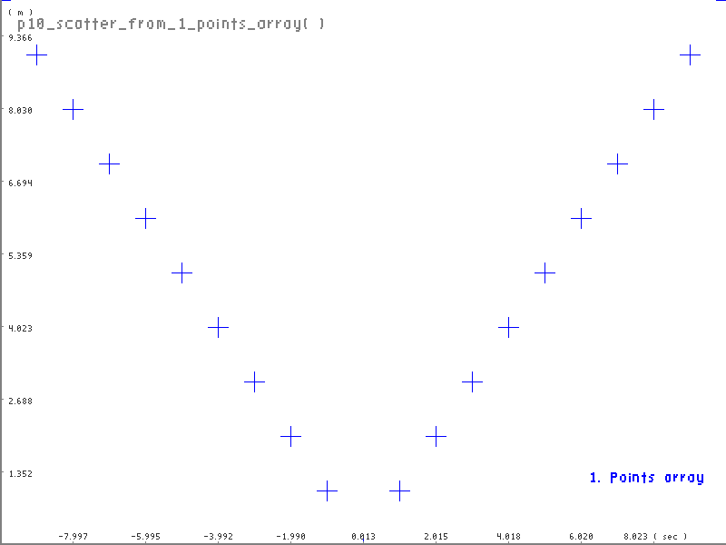
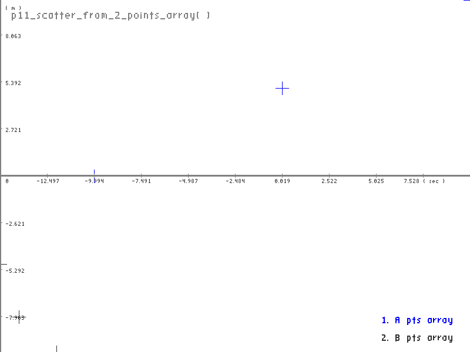

# Plots_in_Odin
A simple plots lib or package for the Odin programming language.

## Description 
This is a small package to make plots in the Odin programming language. Currently it only supports: 
- Line plots
- Scatter plots

But in the future it will possibly support:
- Histogram plots

The plots are saved in .png files of a user specified resolution. The plots are draw to a image buffer and then saved to a png file. So if one whishes, one could draw the plots to a window instead of saving them to a file, with some small custom work from the user of the package. It's the field plot.image_buffer and it contains RGBA values, of plot.size_x x plot.size_y. Or use the function plot_get_image_buffer() to get the image buffer. I only tested this package in Linux, but it should work in Windows, and MacOS systems, because it only uses the Core lib and two stb libs from the Vendors lib of Odin. In Linux I had to compile the "odin/vendors/stb/image/" C module by executing the makefile that is in that diretory. The error that it gives, when the library is not compiled is a linker error, that is I have the option to see the linker errors when I compile the program. This main.odin file contains several examples of the use of this plots_in_odin package.

## License
MIT Open Source License

## How to compile
Install Odin. It's possible that you need to execute the Makefile of the Odin/Vendors/stb/image/

``` bash
$ make
$ make run
```

## The main.odin file contains many examples of usage


``` odin
// Makes a line plot with one trace.
// Plots the function sin( x ) in the range -10 -> 4.
// The function can be what ever you like. In a Custom function,
// not represented points, that should not appear should be marked
// with POINT_NOT_DEFINED_YY.
// The plot is saved in a png file with custom size 800 x 600.
// The plot is created with a white background and dark digits.
// The plot is created with a blue trace.
// The plot is created with a legend with a custom position.
// The plot has a title with a custom position.
// The plit has a manually added point with a custom color.
// The plot has a manually added text label with a custom color.

p01_line_1_trace_white :: proc () {
    fmt.println( "p01_line_1_trace_white() \n" )
    
    // Plot png image file path.
    file_path := "./images/p01_line_1_trace_white.png"

    // Plot image size.
    size_x := 800
    size_y := 600
    // xx range.
    xx := [2]f64{ -10, 4 }
    
    // yy function.
    yy_1 :: proc ( x : f64 ) -> f64 {
        return math.sin_f64( x )
    }

    // Create plot.
    p := plots.plot_create( plots.PlotType.Line, size_x, size_y,
                            background_color=plots.color.white,
                            digits_color=plots.color.gray_dark,
                            xx_units="( sec )",
                            yy_units="( m )" )
    
    // Add one trace to the plot, N can be added in sequence.
    // The trace is a function of X and the XX range has to be the same.
    plots.plot_line( &p,
                     xx,
                     yy_1,
                     nil,
                     "1. sin( x )",
                     [2]int{ size_x - 150, size_y - 80 },
                     plots.color.blue )

    // Optionally, you can add text to the plot.
    plots.plot_text( &p, text="p01_line_1_trace_white()",
        x=20, y=20, color=plots.color.gray_dark, scale=1.8 )

    // Optionally, you can add manually a point mark to the plot in any color.
    plots.plot_point( plots.PointN.P_13, &p, x=254, y=100,
        p_color=plots.color.gray_dark )

    // Optionally, you can add a text label to the point.
    plots.plot_text( &p, text="Watch this point ->", 
        x=254 - 185, y=100 - 5, color=plots.color.red, scale=1.6 )

    plots.plot_save( &p, file_path )
    plots.plot_destroy( &p )
}
```

### This example image output


## Other examples of plots created with this lib

 <br>

 <br>

 <br>

 <br>

 <br>

 <br>

## Have fun!
Best regards,<br>
João Carvalho


